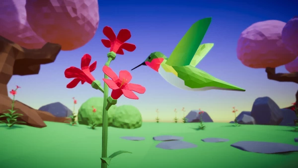
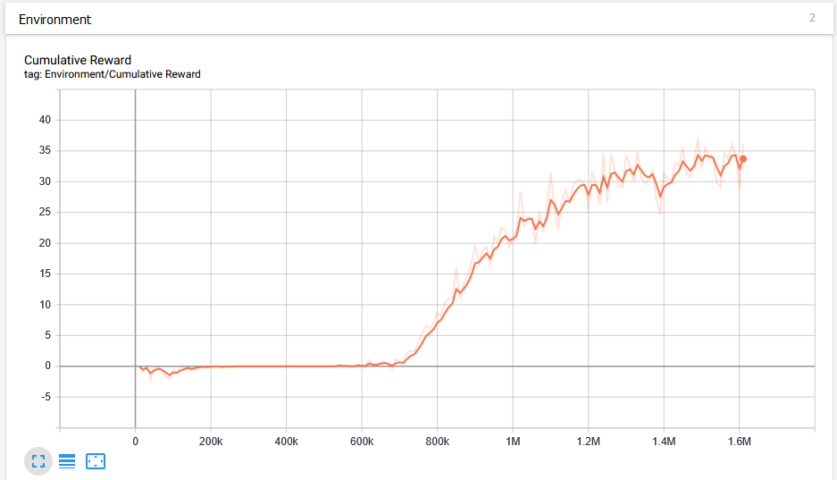
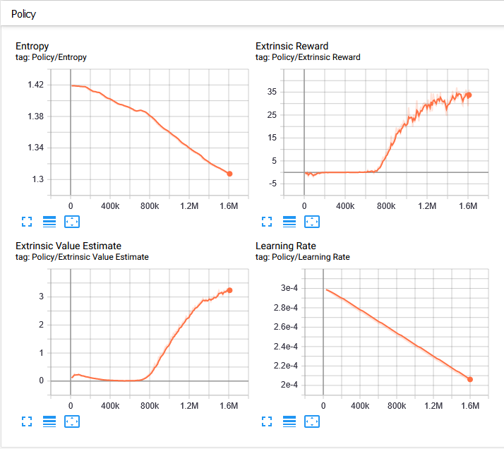

# Summary

Reinforcement Learning is one of the most exciting types of Artificial Intelligence and the Unity ML-Agents project is one of the easiest and most fun ways to get started. 

This project shows how to create intelligent flying hummingbirds that can navigate to flowers, dip their beaks in, and drink nectar. These hummingbirds have six degrees of freedom, meaning they can fly and turn in any direction to find targets. They have more complicated controls and their flight paths cannot be solved with traditional navigation systems. A training environment is crafterd and neural networks are trained to perform this challenging task, then a player can compete against the birds in a simple mini-game.

# Trainining Neural Networks
## Instructions

In `Behavior Parameter` Change the `Behavior Type` of `Hummingbird` to `Default`.

### Running training

`mlagents-learn ./config/trainer_config.yaml --run-id humming_00`

### Visualization

`tensorboard --logdir ./config/summaries`

### Trained Weights and Using It

Use the `Hummingbird.nn` file in the directory specified in `--run-id` parameter during training as `Model` for `Hummingbird`'s `Behavior Parameter`. This `Hummingbird` is the Machine Learning agent against which the player will compete. For the Player `Hummingbird`, set `Behavior Type` to `Heuristic Only`.

## Sample Output

# Playing Against the Trained Agent

   

## Controls

Direction | Key     |Direction | Key     
----------|---------|----------|---------
Forward   | `W`     |Pitch Up  | `↑`
Backward  | `S`     |Pitch Down| `↓`
Left      | `A`     |Turn Left | `←`
Right     | `D`     |Turn Right| `→`
Up        | `E`     |
Down      | `C`     |

# Source

Thanks to the instructor for the course "ML-Agents: Hummingbirds" from Unity Learn is Adam Kelly, an experienced Unity developer who has been creating tutorials and courses on ML-Agents for Immersive Limit since the early beta days in 2018.
